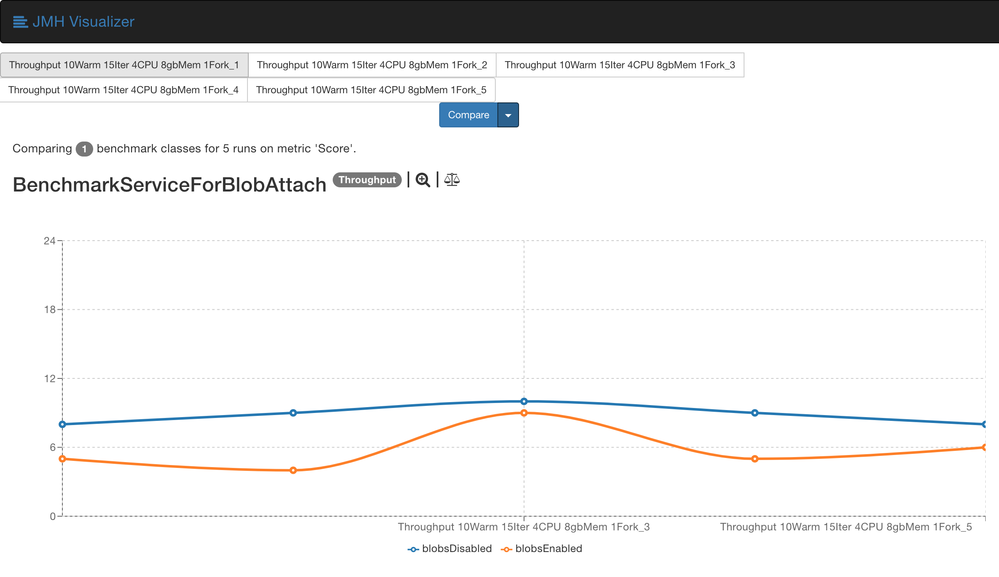

## Blobs Example

This application demonstrates the use of [Blobs](https://github.com/mchandramouli/blobs) that can be used to store and read a blob created by it to and from a storage area respectively.

In this example, the client sends a request to the server which then sends the response back to it. Both the request and response are saved as a blob at the client side to a local file storage at a path given in the configuration.

The client runs on port [9091](http://localhost:9091) and the server on [9090](http://localhost:9090).

## Run the example

* Build the application using

  ```mvn clean package```

* Post build use the following commands to:

  * Run the client on [localhost:9091](http://localhost:9091)

    ```java -jar target/blobExample-service-1.0-SNAPSHOT.jar sampleClient```

  * Run the server on [localhost:9090](http://localhost:9090)

    ```java -jar target/blobExample-service-1.0-SNAPSHOT.jar sampleServer```
 
  * Send a request:
 
    ```curl http://localhost:9091/displayMessage```
    
    You will know that the app is working fine if you get the correct json response like:
    ```
    {
    "clientMessage": "Hello ServerResource. I am ClientResource!",
    "serverResponse": {
    "serverName": "ServerResource",
    "message": "Hi ClientResource! I am ServerResource!"
        }
    }
    ```
 
 ## Record Blobs
 
 To enable the recording of the blobs, set _`enabled`_ to true in _`config-client.yaml`_, run the client and server again and hit the above URL.
 
 You will be able to find the blobs created inside _`blobsRelativePath`_ set in the same config file.
 
 **Defaults:**
  
  _areBlobsEnabled: true_
 
 _blobsRelativePath: ./blobs_
 
 ## Run Benchmarks
 
 The tool used to benchmark the library is [JMH](https://openjdk.java.net/projects/code-tools/jmh/).
 
 Build docker image in local:
 
 ```docker build -t blobs:blobs-example .```
 
 Run docker image
 
 ```docker run --name blobsExample -v <Source>:/app/bin/blobs_home/JMH-BenchmarkingResults --cpus <Cores> -m <Memory> <IMAGE_ID>```
 
 Where,
 ```properties
 Source=Full path of the directory you want to save the JMH benchmark run result to.
 
 Cores=Number of CPU cores you want to allocate to the container. Example: 3.0, 5.5, 4.
 
 IMAGE_ID=Docker IMAGE ID which can be found out by running `docker images` in CMD and then looking for `blobs` Repository.
 
 Memory=Container RAM. Example: 8192m.
```

Look for the `json` file created in the `Source` which will contain the results for the benchmark run.

Use [JMH-Visualizer(Online Version)](https://jmh.morethan.io/) to present the benchmark results.

## Benchmarking Results

The benchmarking was done for 3 different parameters with the blobs library added to the application to store the blobs in local storage and without storing any blob.

### Average Time


### Throughput



### Sample Time


The benchmarking was performed with following parameters:

* CPU: 4
* RAM: 8GB
* Warm-ups: 10
* Iterations: 15
* Environment: MacOS